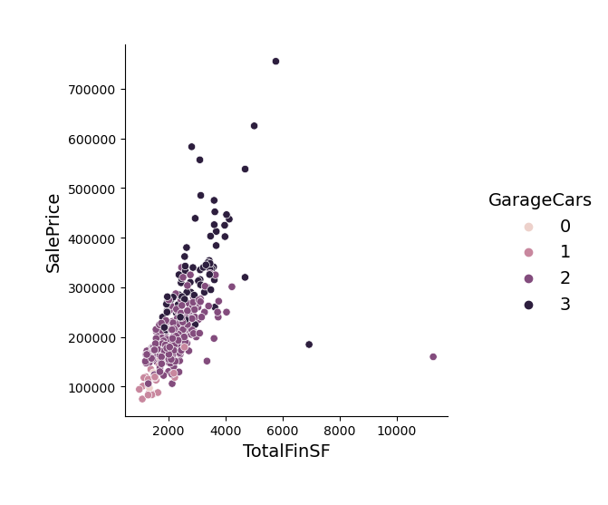

# Capstone
Capstone project for Masters in Data Analytics from NWMS University.  This report and study is authored by Amber Speer.

## Code Sources
### Ken Jee - Data Project from Scratch video series
Video Link: <https://www.youtube.com/watch?v=7O4dpR9QMIM>
GitHub Repo Link: <https://github.com/PlayingNumbers/ds_salary_proj>

### GreekDataGuy
<https://towardsdatascience.com/productionize-a-machine-learning-model-with-flask-and-heroku-8201260503d2>   

## Introduction
This project analyzes housing prices based on a myriad of factors.  The goal is to demonstrate a project that could answer the questions:
1.	How much is this house worth?
2.	How much would these updates increase the value of the house?

## Data 
Because of the limited timeline for this project and the fact that it is to serve as an example of what can be done with data from a given region, this study is using a dataset made for a competition. This type of dataset is made to provide data that is ready-made for analytics.  Given the limited time for this project, collecting data for the Hannibal, MO area was not a possibility. As it turns out, the Ames dataset
for 2-story, single family homes is relatively comparable to Hannibal, MO single family, two-story homes in 2021. In other situations, the data collection would be an enormous, and very important part of the process. However, given the time limitations of this study, this is a reasonable shortcut to take that showcases the process that would need to be taken with any local current data.  

The dataset for this project is the Ames Housing dataset [4] compiled by Dean De Cock. He complied it to be used data science education settings as a more modern alternative to the popular Boston Housing Dataset. It was found on Kaggle at: <https://www.kaggle.com/competitions/house-prices-advanced-regression-techniques>

## Project Report
The entire project report can be found at: <https://www.overleaf.com/read/dwwyzmrrvpzn>

## Project Files
In the HousingPriceData folder you will find all the files for the project.  They are as follows:

    - FlaskAPI folder: Contains all the files for the deployment API.  (This is currently a work in progress and not yet completed.
    - image folder: Contains all images used in the project
    - HousePricePredictionProject.ipynb: Jupyter notebook file with python code for the project
    - cleandf: Excel workbook used to explore and clean the data (using train.csv data)
    - cleantrain.csv: CSV data file created from Excel workbook to train models (cleaned from train.csv)
    - data_description.txt: Text file of attribute and data description downloaded with dataset
    - model_file.p: File created for API to store and transfer pickled data
    - Results.xlsx: Spreadsheet to create HomeValueGraph
    - test.csv: CSV file with test data downloaded with dataset (not used in order to showcase ablity to split data).
    - train.csv: Dataset used for project, downloaded from Kaggle link above.

## Project Overview

### Exploratory Data Analysis 
Before building a model, exploratory data analysis was performed to check assumptions and narrow the number of attributes used to only the most relevant. The first step in this process was checking the correlation of the attributes and the target variable. This was accomplished using by creating a heatmap using the seaborn library.  Studying the target value on the map showed that only a few attributes had a
high correlation to the SalePrice. Many of these features were all realted to square footage. These attributes were GrLivArea, BsmtFinSF1, and BsmtFinSF2. In order to combine these features into one attribute the square footages were
added together to create TotalFinSF. The following formula was used in Excel:

TotalFinSF = (TotalBsmtSF − BsmtUnfSF) + GrLivArea

The heatmap was then run again (see above figure). The attributes with the highest correlation to SalesPrice are TotalFinSF, TotalBath, TotalRmsAbvGr, and GarageCars. The highest and most unexpected correlation was GarageCars. Pair plot and relational plots were done on these attribute to confirm the positive correlation. The most telling plot was a relational plot between SalesPrice and
TotalFinSF with GarageCars set as a hue (see figure below).

